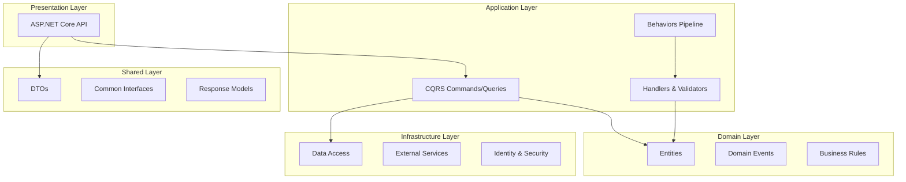

```markdown
# Feature Development Guidelines

To effectively create new features, follow these guidelines step-by-step:

---

### Creating New Features

The development process is structured across several layers: `eStoreCA.Shared`, `eStoreCA.Domain`, `eStoreCA.Application`, `eStoreCA.Infrastructure`, and `eStoreCA.API`. Adhering to the principles and steps outlined below ensures a consistent and maintainable codebase.

---

### Shared Layer (`eStoreCA.Shared`)

**Purpose**: This layer contains Data Transfer Objects (DTOs), common interfaces, and cross-cutting models that are shared across different layers of the application.

**Rules**:

* **Define all DTOs here**.
* **Implement common interfaces**.
* **Provide response models**.
* **Handle localization resources**.

#### 1. Update `AppPermissions.cs` File

**Location**: `eStoreCA.Shared\Common\AppPermissions.cs`

Add a new static class for your entity's permissions:

```csharp
public static class {EntityName}Permissions
{
    public const string List = "Permissions.{EntityName}.List";
    public const string View = "Permissions.{EntityName}.View";
    public const string Create = "Permissions.{EntityName}.Create";
    public const string Edit = "Permissions.{EntityName}.Edit";
    public const string Delete = "Permissions.{EntityName}.Delete";
}
```

#### 2. Create DTOs

**Location**: `eStoreCA.Shared/Dtos/{EntityName}/`

**Namespace**: Ensure the namespace is `eStoreCA.Shared.Dtos`. Do not include the entity name in the namespace (e.g., `eStoreCA.Shared.Dtos.EntityName` is incorrect).

**Files**:

* `Create{EntityName}Dto.cs`
* `Update{EntityName}Dto.cs`
* `Get{EntityName}Dto.cs`
* `GetAllByPage{EntityName}Dto.cs`
* `GetAll{EntityName}Dto.cs` (for list retrieval)
* `Delete{EntityName}Dto.cs` (if needed for deletion operations)

**DTO Naming Conventions**:

* `Create{EntityName}Dto.cs`: For creation operations.
* `Update{EntityName}Dto.cs`: For update operations.
* `Get{EntityName}Dto.cs`: For single entity retrieval.
* `GetAll{EntityName}Dto.cs`: For list retrieval.
* `GetAllByPage{EntityName}Dto.cs`: For paginated retrieval.
* `Delete{EntityName}Dto.cs`: For deletion (if needed).

**DTO Location Example**:

```
eStoreCA.Shared/
├── Dtos/
│   ├── Auth/
│   │   ├── LoginDto.cs
│   │   ├── RegisterDto.cs
│   │   └── RefreshTokenDto.cs
│   ├── Category/
│   │   ├── CreateCategoryDto.cs
│   │   ├── UpdateCategoryDto.cs
│   │   ├── GetCategoryDto.cs
│   │   └── GetAllByPageCategoryDto.cs
│   └── {NewEntity}/
│       ├── Create{Entity}Dto.cs
│       ├── Update{Entity}Dto.cs
│       └── Get{Entity}Dto.cs
```

#### 3. Create DTO Validation File

**Location**: Beside the DTO file (e.g., `eStoreCA.Shared/Dtos/{EntityName}/Create{EntityName}DtoValidator.cs`)

Use FluentValidation for DTO validation:

```csharp
// Separate FluentValidation validator
public class CreateCategoryDtoValidator : AbstractValidator<CreateCategoryDto>
{
    public CreateCategoryDtoValidator()
    {
        RuleFor(x => x.Title)
            .NotEmpty().WithMessage("Title is required")
            .MaximumLength(100).WithMessage("Title cannot exceed 100 characters");
    }
}
```

---

### Domain Layer (`eStoreCA.Domain`)

**Purpose**: This layer contains the core business logic, entities, and domain events. It is independent of other layers.

**Rules**:

* **Pure business logic only** - no external dependencies.
* **Entities inherit from `BaseEntity<TId>`**.
* **Implement domain interfaces**: `IAuditable`, `ISoftDelete`, `IDataConcurrency`.
* **Use domain events for cross-cutting concerns**.
* **No references to other layers**.
* **No infrastructure concerns**.

#### 4. Creating Domain Entity

**Location**: `eStoreCA.Domain/Entities/{EntityName}.cs`

**Namespace**: Ensure the namespace is `eStoreCA.Domain.Entities`.

**Entity Structure Example**:

```csharp
public class Category : BaseEntity<Guid>, IAuditable, ISoftDelete, IDataConcurrency
{
    public string Title { get; set; }
    public bool IsActive { get; set; }

    // Audit fields from IAuditable
    public Guid CreatedBy { get; set; }
    public DateTime CreatedAt { get; set; }
    public Guid? LastModifiedBy { get; set; }
    public DateTime? LastModifiedAt { get; set; }

    // Soft delete from ISoftDelete
    public bool IsDeleted { get; set; }
    public DateTime? DeletedAt { get; set; }
    public Guid? DeletedBy { get; set; }

    // Concurrency from IDataConcurrency
    public byte[] RowVersion { get; set; }
}
```

#### 5. Create Folder for Entity Events

**Location**:

* `eStoreCA.Domain/Events/{EntityName}/{EntityName}CreatedEvent.cs`
* `eStoreCA.Domain/Events/{EntityName}/{EntityName}DeletedEvent.cs`
* `eStoreCA.Domain/Events/{EntityName}/{EntityName}UpdatedEvent.cs`

**Code Example**:

```csharp
public class {EntityName}{MethodName}Event : IDomainEvent
{
    public {EntityName}{MethodName}Event({MethodName}{EntityName}Dto {entityName}CamelCase)
    {
        this.{EntityName} = {entityName}CamelCase;
    }

    public {MethodName}{EntityName}Dto {EntityName} { get; }

}
```

Where `{MethodName}` can be `Created`, `Deleted`, or `Updated`. Replace `{entityName}CamelCase` with the camelCase version of your entity name and `{EntityName}` with the PascalCase version.

---

### Application Layer (`eStoreCA.Application`)

**Purpose**: This layer contains application logic, CQRS implementation, and cross-cutting behaviors. It orchestrates the flow of data and business operations.

**Rules**:

* **Follow CQRS pattern** - separate Commands and Queries.
* **Use Mediator package for request handling**.
* **Use Mapster package for mapping objects**.
* **Implement validation using FluentValidation**.
* **Apply authorization attributes**.
* **Use pipeline behaviors for cross-cutting concerns**.

**Feature Structure**:

```
Features/
├── {EntityName}/
│   ├── Commands/
│   │   ├── Create/
│   │   │   ├── Create{Entity}CommandHandler.cs
│   │   │   └── Create{Entity}CommandValidator.cs
│   │   ├── Update/
│   │   │   ├── Update{Entity}CommandHandler.cs
│   │   │   └── Update{Entity}CommandValidator.cs
│   │   └── Delete/
│   │       ├── Delete{Entity}CommandHandler.cs
│   │       └── Delete{Entity}CommandValidator.cs
│   ├── Queries/
│   │   ├── GetAll/
│   │   │   └── GetAll{Entity}QueryHandler.cs
│   │   ├── GetById/
│   │   │   └── GetById{Entity}QueryHandler.cs
│   │   └── GetAllByPage/
│   │       └── GetAllByPage{Entity}QueryHandler.cs
│   └── Events/
│       ├── {Entity}CreatedEventHandler.cs
│       ├── {Entity}UpdatedEventHandler.cs
│       └── {Entity}DeletedEventHandler.cs
```

#### 6. Create Commands and Queries

**Location**: `eStoreCA.Application/Features/{EntityName}/Commands/` and `eStoreCA.Application/Features/{EntityName}/Queries/`

**Namespace**: Ensure the namespace for commands and their handlers/validators is `eStoreCA.Application.Features.Commands`. Similarly, for queries, use `eStoreCA.Application.Features.Queries`.

**Code Example for Create Command and Handler (in the same file)**:

```csharp
// Start Create Code
namespace eStoreCA.Application.Features.Commands
{
    #region Create Command Parameters
    [Authorize(Policy = AppPermissions.{EntityName}Permissions.Create)]
    public class Create{EntityName}Command : Create{EntityName}Dto, IRequest<MyAppResponse<Guid>>
    {
    }
    #endregion

    #region Create Command Handler
    public class Create{EntityName}CommandHandler : IRequestHandler<Create{EntityName}Command, MyAppResponse<Guid>>
    {
        private readonly IApplicationDbContext _dbContext;
        private readonly IMapper _mapper;

        public Create{EntityName}CommandHandler(IMapper mapper, IApplicationDbContext dbContext)
        {
            _mapper = mapper;
            _dbContext = dbContext;
        }

        public async ValueTask<MyAppResponse<Guid>> Handle(Create{EntityName}Command request, CancellationToken cancellationToken)
        {
            try
            {
                {EntityName} entityToCreate = _mapper.Map<{EntityName}>(request);
                await _dbContext.{EntityName}Plural.AddAsync(entityToCreate);

                int effectedRows = await _dbContext.SaveChangesAsync(cancellationToken);
                if (effectedRows != 0)
                {
                    return new MyAppResponse<Guid>(entityToCreate.Id, null);
                }
            }
            catch (Exception ex)
            {
                return new MyAppResponse<Guid>("DB Error: " + ex.Message);
            }
            return new MyAppResponse<Guid>("Error in saving data");
        }
    }
    #endregion
}
// End Create Code
```

**Code Example for Create Command Validator**:

```csharp
// Separate FluentValidation validator
namespace eStoreCA.Application.Features.Commands // Ensure this namespace
{
    public class Create{EntityName}CommandValidator : AbstractValidator<Create{EntityName}Command>
    {
        private readonly IApplicationDbContext _dbContext;
        public Create{EntityName}CommandValidator(IApplicationDbContext dbContext)
        {
            _dbContext = dbContext;
            RuleFor<Guid>(x => x.Id).NotEqual(Guid.Empty); ;
            RuleFor(o => o.Title).NotEmpty().MaximumLength(255);

            #region Custom Constructor
            #endregion Custom Constructor

            RuleFor(o => o.Title)
                                 .NotEmpty()
                                 .MaximumLength(255)
                                 .MustAsync(async (command, Title, cancellationToken) => await UniqueTitle(Title, cancellationToken))
                                 .WithMessage("Title must be unique.");
        }

        private async Task<bool> UniqueTitle(string name, CancellationToken cancellationToken)
        {
            return !await _dbContext.{EntityName}Plural
                .AnyAsync(o => o.Title.ToUpper() == name.Trim().ToUpper(), cancellationToken);
        }
        #region Custom
        #endregion Custom
    }
}
```

Apply similar patterns for **Update** and **Delete** commands, and their respective validators and handlers.

**Code Example for `GetAllByPage{EntityName}QueryHandler` Query**:

```csharp
namespace eStoreCA.Application.Features.Queries
{
    [Authorize(Policy = AppPermissions.{EntityName}Permissions.List)]
    public class GetAllByPage{EntityName}Query : GetAllByPage{EntityName}Dto, IRequest<MyAppResponse<PagedResult<GetAllByPage{EntityName}Dto>>>
    {
    }

    public class GetAllByPage{EntityName}QueryHandler : IRequestHandler<GetAllByPage{EntityName}Query, MyAppResponse<PagedResult<GetAllByPage{EntityName}Dto>>>
    {
        private readonly IApplicationDbContext _dbContext;

        public GetAllByPage{EntityName}QueryHandler(IApplicationDbContext dbContext)
        {
            _dbContext = dbContext;
        }

        public async ValueTask<MyAppResponse<PagedResult<GetAllByPage{EntityName}Dto>>> Handle(GetAllByPage{EntityName}Query request, CancellationToken cancellationToken)
        {
            PagedResult<GetAllByPage{EntityName}Dto> pagedResult = null;

            var query = _dbContext.{EntityName}Plural.AsQueryable(); // Use the plural form here

            if (!string.IsNullOrEmpty(request.Search))
            {
                query = query.Where(o => (string.IsNullOrEmpty(request.Search) || o.Title.ToUpper().Contains(request.Search)));
            }

            if (!string.IsNullOrEmpty(request.SortColumnName))
            {
                query = request.AscendingOrder ? query.OrderByDynamic(request.SortColumnName, AppEnums.DataOrderDirection.Asc) : query.AsQueryable().OrderByDynamic(request.SortColumnName, AppEnums.DataOrderDirection.Desc);
            }

            #region Custom
            #endregion Custom

            try
            {
                var totalRecords = await query.CountAsync(cancellationToken);
                if (totalRecords > 0)
                {
                    var result = await query.Skip((request.PageIndex - 1) * request.PageSize)
                               .Take(request.PageSize).ToListAsync(cancellationToken);

                    if (result.Any())
                    {
                        pagedResult = new PagedResult<GetAllByPage{EntityName}Dto>(
                            result.Adapt<List<GetAllByPage{EntityName}Dto>>(),
                            totalRecords,
                            request.PageIndex,
                            request.PageSize
                        );

                        return new MyAppResponse<PagedResult<GetAllByPage{EntityName}Dto>>(pagedResult);
                    }
                }
            }
            catch (Exception ex)
            {
                return new MyAppResponse<PagedResult<GetAllByPage{EntityName}Dto>>("DB Error: " + ex.Message);
            }

            return new MyAppResponse<PagedResult<GetAllByPage{EntityName}Dto>>(pagedResult);
        }
    }
}
```

#### 7. Create Entity Events Handlers

**Location**: `eStoreCA.Application/Features/{EntityName}/Events/`

**Code Example**:

```csharp
public class {EntityName}CreatedEventHandler : INotificationHandler<{EntityName}CreatedEvent>
{
    public async ValueTask Handle({EntityName}CreatedEvent notification, CancellationToken cancellationToken)
    {
        Console.WriteLine("CreatedEvent: " + notification);
    }
}
```

#### 8. Update `IApplicationDbContext.cs` File

**Location**: `eStoreCA.Application\Interfaces\Common\IApplicationDbContext.cs`

Add a `DbSet` for your new entity:

```csharp
DbSet<{EntityName}> {EntityName}Plural { get; set; }
```

---

### Infrastructure Layer (`eStoreCA.Infrastructure`)

**Purpose**: This layer handles data access, external services, and infrastructure-specific concerns.

**Rules**:

* **Configure Entity Framework mappings**.
* **Handle identity and authorization**.
* **Implement external service integrations**.
* **Use dependency injection for service registration**.

#### 9. Update `ApplicationDbContext.cs` File

**Location**: `eStoreCA.Infrastructure\Data\ApplicationDbContext.cs`

Add the `DbSet` to your context:

```csharp
public virtual DbSet<{EntityName}> {EntityName}Plural { get; set; }
```

#### 10. Create Entity Configuration

**Location**: `eStoreCA.Infrastructure\EntityConfiguration`

**Namespace**: Ensure the namespace is `eStoreCA.Infrastructure.Data.EntityConfiguration`.

**Code Example**:

```csharp
public partial class {EntityName}Configuration : IEntityTypeConfiguration<{EntityName}>
{
    public void Configure(EntityTypeBuilder<{EntityName}> builder)
    {
        // table
        builder.ToTable("{EntityName}Plural", "dbo"); // Use the plural form for the table name

        // key
        builder.HasKey(t => t.Id);
        builder.Property(t => t.Id).HasColumnName("Id").HasColumnType("uniqueidentifier").IsRequired();
        builder.Property(t => t.Title).HasColumnName("Title").HasColumnType("nvarchar(255)").HasMaxLength(255).IsRequired();
        builder.Property(t => t.IsActive).HasColumnName("IsActive").HasColumnType("bit").IsRequired();
        builder.Property(t => t.CreatedBy).HasColumnName("CreatedBy").HasColumnType("uniqueidentifier").IsRequired();
        builder.Property(t => t.CreatedAt).HasColumnName("CreatedAt").HasColumnType("datetime2").IsRequired();
        builder.Property(t => t.LastModifiedBy).HasColumnName("LastModifiedBy").HasColumnType("uniqueidentifier");
        builder.Property(t => t.LastModifiedAt).HasColumnName("LastModifiedAt").HasColumnType("datetime2");
        builder.Property(t => t.RowVersion).HasColumnName("RowVersion").IsConcurrencyToken().ValueGeneratedOnAddOrUpdate();
        builder.Property(t => t.IsDeleted).HasColumnName("IsDeleted").HasColumnType("bit").IsRequired(); // Changed from SoftDeleted to IsDeleted
        builder.Property(t => t.DeletedBy).HasColumnName("DeletedBy").HasColumnType("uniqueidentifier");
        builder.Property(t => t.DeletedAt).HasColumnName("DeletedAt").HasColumnType("datetime2");
    }
}
```

---

### API Layer (`eStoreCA.API`)

**Purpose**: This layer contains controllers, middleware, and API configuration, serving as the entry point for client applications.

**Rules**:

* **Controllers inherit from `BaseApiController`**.
* **Use API versioning**.
* **Apply proper HTTP status codes**.
* **Implement proper error handling**.
* **Use Swagger for documentation**.

#### 11. Add API Controller

**Location**: `eStoreCA.API/Controllers/{EntityName}Controller.cs`

**Code Example**:

```csharp
[ApiVersion("1.0")]
public class {EntityName}Controller : BaseApiController
{
    public {EntityName}Controller()
    {
    }

    [HttpGet]
    [ProducesResponseType(200, Type = typeof(MyAppResponse<List<GetAll{EntityName}Dto>>))]
    public async Task<IActionResult> GetAll(string searchValue = "", string orderBy = "", bool orderAscendingDirection = true)
    {
        try
        {
            bool byPassCache = true;

            if (string.IsNullOrEmpty(searchValue))
            {
                byPassCache = false;
            }

            var result = await _Mediator.Send(new GetAll{EntityName}Query()
            {
                Search = searchValue,
                SortColumnName = orderBy,
                AscendingOrder = orderAscendingDirection,
                BypassCache = byPassCache
            });

            return ActionResult(result);
        }
        catch (Exception ex)
        {
            return ActionResult<string>(null, ex);
        }
    }

    [AllowAnonymous]
    [HttpGet]
    [ProducesResponseType(200, Type = typeof(MyAppResponse<PagedResult<GetAllByPage{EntityName}Dto>>))]
    public async Task<IActionResult> GetAllPagedList(string searchValue = "", string orderBy = "", bool orderAscendingDirection = true, int pageIndex = 1, int pageSize = 10)
    {
        try
        {
            var result = await _Mediator.Send(new GetAllByPage{EntityName}Query()
            {
                Search = searchValue,
                SortColumnName = orderBy,
                AscendingOrder = orderAscendingDirection,
                PageIndex = pageIndex,
                PageSize = pageSize
            });

            return ActionResult(result);
        }
        catch (Exception ex)
        {
            return ActionResult<string>(null, ex);
        }
    }

    [HttpGet("{id:Guid}", Name = "GetById{EntityName}")]
    [ProducesResponseType(StatusCodes.Status200OK, Type = typeof(MyAppResponse<Get{EntityName}Dto>))] // Changed GetById{EntityName}Dto to Get{EntityName}Dto
    [ProducesResponseType(StatusCodes.Status404NotFound)]
    [ProducesDefaultResponseType]
    public async Task<IActionResult> GetById(Guid id)
    {
        try
        {
            var result = await _Mediator.Send(new GetById{EntityName}Query() { Id = id });
            return ActionResult(result);
        }
        catch (Exception ex)
        {
            return ActionResult<string>(null, ex);
        }
    }

    [HttpPost]
    [ProducesResponseType(201, Type = typeof(Guid))]
    [ProducesResponseType(StatusCodes.Status201Created)]
    [ProducesResponseType(StatusCodes.Status404NotFound)]
    [ProducesResponseType(StatusCodes.Status500InternalServerError)]
    public async Task<IActionResult> Create(Create{EntityName}Dto model)
    {
        try
        {
            if (model == null)
            {
                return BadRequest(new MyAppResponse<Get{EntityName}Dto>("Invalid object")); // Changed GetById{EntityName}Dto to Get{EntityName}Dto
            }

            var dtoValidator = new Create{EntityName}DtoValidator();
            var validationResult = dtoValidator.Validate(model);

            if (validationResult != null && validationResult.IsValid == false)
            {
                return ReturnActionResult("", false, validationResult.Errors.Select(modelError => modelError.ErrorMessage).ToList(), "", "");
            }

            var request = _Mapper.Map<Create{EntityName}Command>(model);
            var result = await _Mediator.Send(request);

            if (result.Succeeded)
            {
                // Fire-and-forget for the notification publishing
                _ = Task.Run(() => _Mediator.Publish(new {EntityName}CreatedEvent(model)));
            }

            return ActionResult(result);
        }
        catch (Exception ex)
        {
            return ActionResult<string>(null, ex);
        }
    }

    [HttpPut]
    [ProducesResponseType(StatusCodes.Status400BadRequest)]
    [ProducesResponseType(StatusCodes.Status204NoContent)]
    [ProducesResponseType(StatusCodes.Status500InternalServerError)]
    public async Task<IActionResult> Update(Update{EntityName}Dto model)
    {
        try
        {
            if (model == null)
            {
                return BadRequest(new MyAppResponse<bool>("Invalid object"));
            }
            var dtoValidator = new Update{EntityName}DtoValidator();
            var validationResult = dtoValidator.Validate(model);

            if (validationResult != null && validationResult.IsValid == false)
            {
                return ReturnActionResult("", false, validationResult.Errors.Select(modelError => modelError.ErrorMessage).ToList(), "", "");
            }

            var request = _Mapper.Map<Update{EntityName}Command>(model);
            var result = await _Mediator.Send(request);

            if (result.Succeeded)
            {
                // Fire-and-forget for the notification publishing
                _ = Task.Run(() => _Mediator.Publish(new {EntityName}UpdatedEvent(model)));
            }

            return ActionResult(result);
        }
        catch (Exception ex)
        {
            return ActionResult<string>(null, ex);
        }
    }

    [HttpDelete("{id}")]
    [ProducesResponseType(StatusCodes.Status400BadRequest)]
    [ProducesResponseType(StatusCodes.Status204NoContent)]
    [ProducesResponseType(StatusCodes.Status500InternalServerError)]
    public async Task<IActionResult> Delete(Delete{EntityName}Dto model)
    {
        try
        {
            var result = await _Mediator.Send(new Delete{EntityName}Command() { Id = model.Id });

            if (result.Succeeded)
            {
                // Fire-and-forget for the notification publishing
                _ = Task.Run(() => _Mediator.Publish(new {EntityName}DeletedEvent(model)));
            }

            return ActionResult(result);
        }
        catch (Exception ex)
        {
            return ActionResult<string>(null, ex);
        }
    }
}
```

---

### Pipeline Behaviors

The following behaviors are automatically applied:

1.  **UnhandledExceptionBehaviour**: Global exception handling.
2.  **AuthorizationBehaviour**: Permission-based authorization.
3.  **ValidationBehaviour**: FluentValidation integration.
4.  **CachingBehaviour**: Response caching (optional).
5.  **PerformanceBehaviour**: Performance monitoring (optional).

---

### JWT Authentication

* **Use JWT Bearer tokens**.
* **Implement refresh token mechanism**.
* **Apply authorization attributes consistently**.
* **Handle token expiration gracefully**.

---

### Code Reviews

* **Review for SOLID principles adherence**.
* **Check security implementations**.
* **Verify test coverage**.
* **Ensure documentation is updated**.

---

### Refactoring Guidelines

* **Refactor when adding new features**.
* **Extract common patterns**.
* **Improve performance bottlenecks**.
* **Update dependencies regularly**.

---

### Database Operations

* **Use async/await for all database operations**.
* **Implement pagination for list queries**.
* **Use projection for read operations**.
* **Apply proper indexing**.
* **Avoid N+1 query problems**.

---

### Refactoring Guidelines

* **Refactor when adding new features**.
* **Extract common patterns**.
* **Improve performance bottlenecks**.
* **Update dependencies regularly**.

---

## 📚 Additional Resources

* [Clean Architecture by Robert C. Martin](https://blog.cleancoder.com/uncle-bob/2012/08/13/the-clean-architecture.html)
* [CQRS Pattern](https://docs.microsoft.com/en-us/azure/architecture/patterns/cqrs)
* [Mediator Documentation](https://github.com/martinothamar/Mediator)
* [Mapster Documentation](https://github.com/MapsterMapper/Mapster)
* [FluentValidation Documentation](https://docs.fluentvalidation.net/)
* [ASP.NET Core Best Practices](https://docs.microsoft.com/en-us/aspnet/core/fundamentals/best-practices)

---

## 🏗️ Architecture Overview

### Clean Architecture Layers



### Project Structure

```
eCommerceMultiArchitectureSolution/
├── eStoreCA.API/           # Web API Layer
├── eStoreCA.Application/   # Application Logic (CQRS)
├── eStoreCA.Domain/        # Business Logic & Entities
├── eStoreCA.Infrastructure/# Data Access & External Services
└── eStoreCA.Shared/        # Cross-cutting Concerns & DTOs
```

---

## 🧩 Core Principles

### ✅ SOLID Principles

#### Single Responsibility Principle (SRP)

* **One class, one job**
* Each command handler handles only one operation.
* Each service has a single, well-defined purpose.
* Separate read and write operations (CQRS).

```csharp
// ✅ GOOD: Single responsibility
public class CreateCategoryCommandHandler : IRequestHandler<CreateCategoryCommand, MyAppResponse<Guid>>
{
    // Only handles category creation
}

// ❌ BAD: Multiple responsibilities
public class CategoryManager
{
    public void CreateCategory() { }
    public void UpdateCategory() { }
    public void DeleteCategory() { }
    public void SendEmailNotification() { } // Different responsibility!
}
```

#### Open/Closed Principle (OCP)

* **Extendable, not modifiable**
* Use interfaces and dependency injection.
* Extend behavior through new implementations.

```csharp
// ✅ GOOD: Open for extension
public interface INotificationService
{
    Task SendAsync(string message);
}

public class EmailNotificationService : INotificationService { }
public class SmsNotificationService : INotificationService { } // Extension
```

#### Liskov Substitution Principle (LSP)

* **Subclasses should not break base class behavior**
* Derived classes must be substitutable for base classes.

#### Interface Segregation Principle (ISP)

* **Many small interfaces > one fat interface**
* Create focused, role-specific interfaces.

```csharp
// ✅ GOOD: Segregated interfaces
public interface IReadOnlyRepository<T>
{
    Task<T> GetByIdAsync(Guid id);
    Task<IEnumerable<T>> GetAllAsync();
}

public interface IWriteRepository<T>
{
    Task<T> CreateAsync(T entity);
    Task UpdateAsync(T entity);
    Task DeleteAsync(Guid id);
}
```

#### Dependency Inversion Principle (DIP)

* **Depend on abstractions, not concretes**
* Use dependency injection consistently.

```csharp
// ✅ GOOD: Depends on abstraction
public class CategoryService
{
    private readonly ICategoryRepository _repository;

    public CategoryService(ICategoryRepository repository)
    {
        _repository = repository;
    }
}
```

### ✅ KISS – Keep It Simple, Stupid

* **Prefer simple, clear logic over clever hacks**.
* Avoid overengineering solutions.
* Write code that is easy to understand and maintain.
* Use descriptive names for variables, methods, and classes.

### ✅ DRY – Don't Repeat Yourself

* **Reuse code via methods, classes, or services**.
* Extract reusable logic to shared components.
* Use base classes and interfaces to eliminate duplication.
* Centralize common functionality in the Shared layer.

```