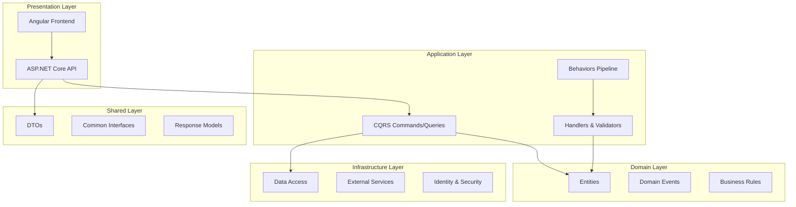

# 🤖 AI Agent Rules for eCommerce Clean Architecture Solution

> Comprehensive guidelines for AI agents working with this Clean Architecture eCommerce solution

---

## 📋 Table of Contents

- [Architecture Overview](#architecture-overview)
- [Core Principles](#core-principles)
- [Layer-Specific Rules](#layer-specific-rules)
- [Feature Development Guidelines](#feature-development-guidelines)
- [DTO Management](#dto-management)
- [CQRS Implementation](#cqrs-implementation)
- [Security & Authorization](#security--authorization)
- [Frontend Development](#frontend-development)
- [Code Quality Standards](#code-quality-standards)
- [Performance Guidelines](#performance-guidelines)
- [Testing Requirements](#testing-requirements)

---

## 🏗️ Architecture Overview

### Clean Architecture Layers



### Project Structure

```
eCommerceMultiArchitectureSolution/
├── angularApp/                    # Angular 19 Frontend
├── eStoreCA.API/                  # Web API Layer
├── eStoreCA.Application/          # Application Logic (CQRS)
├── eStoreCA.Domain/               # Business Logic & Entities
├── eStoreCA.Infrastructure/       # Data Access & External Services
└── eStoreCA.Shared/              # Cross-cutting Concerns & DTOs
```

---

## 🧩 Core Principles

### ✅ SOLID Principles

#### Single Responsibility Principle (SRP)

- **One class, one job**
- Each command handler handles only one operation
- Each service has a single, well-defined purpose
- Separate read and write operations (CQRS)

```csharp
// ✅ GOOD: Single responsibility
public class CreateCategoryCommandHandler : IRequestHandler<CreateCategoryCommand, MyAppResponse<Guid>>
{
    // Only handles category creation
}

// ❌ BAD: Multiple responsibilities
public class CategoryManager
{
    public void CreateCategory() { }
    public void UpdateCategory() { }
    public void DeleteCategory() { }
    public void SendEmailNotification() { } // Different responsibility!
}
```

#### Open/Closed Principle (OCP)

- **Extendable, not modifiable**
- Use interfaces and dependency injection
- Extend behavior through new implementations

```csharp
// ✅ GOOD: Open for extension
public interface INotificationService
{
    Task SendAsync(string message);
}

public class EmailNotificationService : INotificationService { }
public class SmsNotificationService : INotificationService { } // Extension
```

#### Liskov Substitution Principle (LSP)

- **Subclasses should not break base class behavior**
- Derived classes must be substitutable for base classes

#### Interface Segregation Principle (ISP)

- **Many small interfaces > one fat interface**
- Create focused, role-specific interfaces

```csharp
// ✅ GOOD: Segregated interfaces
public interface IReadOnlyRepository<T>
{
    Task<T> GetByIdAsync(Guid id);
    Task<IEnumerable<T>> GetAllAsync();
}

public interface IWriteRepository<T>
{
    Task<T> CreateAsync(T entity);
    Task UpdateAsync(T entity);
    Task DeleteAsync(Guid id);
}
```

#### Dependency Inversion Principle (DIP)

- **Depend on abstractions, not concretes**
- Use dependency injection consistently

```csharp
// ✅ GOOD: Depends on abstraction
public class CategoryService
{
    private readonly ICategoryRepository _repository;

    public CategoryService(ICategoryRepository repository)
    {
        _repository = repository;
    }
}
```

### ✅ KISS – Keep It Simple, Stupid

- **Prefer simple, clear logic over clever hacks**
- Avoid overengineering solutions
- Write code that is easy to understand and maintain
- Use descriptive names for variables, methods, and classes

### ✅ DRY – Don't Repeat Yourself

- **Reuse code via methods, classes, or services**
- Extract reusable logic to shared components
- Use base classes and interfaces to eliminate duplication
- Centralize common functionality in the Shared layer

---

## 🏛️ Layer-Specific Rules

### 1. Domain Layer (`eStoreCA.Domain`)

**Purpose**: Contains business logic, entities, and domain events

**Rules**:

- ✅ **Pure business logic only** - no external dependencies
- ✅ **Entities inherit from `BaseEntity<TId>`**
- ✅ **Implement domain interfaces**: `IAuditable`, `ISoftDelete`, `IDataConcurrency`
- ✅ **Use domain events for cross-cutting concerns**
- ❌ **No references to other layers**
- ❌ **No infrastructure concerns**

**Entity Structure**:

```csharp
public class Category : BaseEntity<Guid>, IAuditable, ISoftDelete, IDataConcurrency
{
    public string Title { get; set; }
    public bool IsActive { get; set; }

    // Audit fields from IAuditable
    public Guid CreatedBy { get; set; }
    public DateTime CreatedAt { get; set; }
    public Guid? LastModifiedBy { get; set; }
    public DateTime? LastModifiedAt { get; set; }

    // Soft delete from ISoftDelete
    public bool IsDeleted { get; set; }
    public DateTime? DeletedAt { get; set; }
    public Guid? DeletedBy { get; set; }

    // Concurrency from IDataConcurrency
    public byte[] RowVersion { get; set; }
}
```

### 2. Application Layer (`eStoreCA.Application`)

**Purpose**: Contains application logic, CQRS implementation, and cross-cutting behaviors

**Rules**:

- ✅ **Follow CQRS pattern** - separate Commands and Queries
- ✅ **Use Mediator for request handling**
- ✅ **Implement validation using FluentValidation**
- ✅ **Apply authorization attributes**
- ✅ **Use pipeline behaviors for cross-cutting concerns**

**Feature Structure**:

```
Features/
├── {EntityName}/
│   ├── Commands/
│   │   ├── Create/
│   │   │   ├── Create{Entity}CommandHandler.cs
│   │   │   └── Create{Entity}CommandValidator.cs
│   │   ├── Update/
│   │   └── Delete/
│   ├── Queries/
│   │   ├── GetAll/
│   │   ├── GetById/
│   │   └── GetAllByPage/
│   └── Events/
│       ├── {Entity}CreatedEventHandler.cs
│       ├── {Entity}UpdatedEventHandler.cs
│       └── {Entity}DeletedEventHandler.cs
```

### 3. Infrastructure Layer (`eStoreCA.Infrastructure`)

**Purpose**: Contains data access, external services, and infrastructure concerns

**Rules**:

- ✅ **Implement repository patterns**
- ✅ **Configure Entity Framework mappings**
- ✅ **Handle identity and authorization**
- ✅ **Implement external service integrations**
- ✅ **Use dependency injection for service registration**

### 4. API Layer (`eStoreCA.API`)

**Purpose**: Contains controllers, middleware, and API configuration

**Rules**:

- ✅ **Controllers inherit from `BaseApiController`**
- ✅ **Use API versioning**
- ✅ **Apply proper HTTP status codes**
- ✅ **Implement proper error handling**
- ✅ **Use Swagger for documentation**

### 5. Shared Layer (`eStoreCA.Shared`)

**Purpose**: Contains DTOs, common interfaces, and cross-cutting models

**Rules**:

- ✅ **Define all DTOs here**
- ✅ **Implement common interfaces**
- ✅ **Provide response models**
- ✅ **Handle localization resources**

---

## 🎯 Feature Development Guidelines

### Creating New Features

1. **Start with Domain Entity**

   ```
   Location: eStoreCA.Domain/Entities/{EntityName}.cs
   ```

2. **Create DTOs**

   ```
   Location: eStoreCA.Shared/Dtos/{EntityName}/
   Files:
   - Create{EntityName}Dto.cs
   - Update{EntityName}Dto.cs
   - Get{EntityName}Dto.cs
   - GetAllByPage{EntityName}Dto.cs
   ```

3. **Implement CQRS Commands/Queries**

   ```
   Location: eStoreCA.Application/Features/{EntityName}/
   ```

4. **Add API Controller**

   ```
   Location: eStoreCA.API/Controllers/{EntityName}Controller.cs
   ```

5. **Create Angular Service & Components**
   ```
   Location: angularApp/src/app/features/{entityname}/
   ```

### Feature Checklist

- [ ] Domain entity with proper interfaces
- [ ] Complete DTO set (Create, Update, Get, GetAllByPage)
- [ ] CQRS commands with handlers and validators
- [ ] CQRS queries with handlers
- [ ] Domain event handlers (if applicable)
- [ ] API controller with proper endpoints
- [ ] Authorization attributes applied
- [ ] Angular service for API communication
- [ ] Angular components for UI
- [ ] Unit tests for handlers
- [ ] Integration tests for API endpoints

---

## 📦 DTO Management

### DTO Naming Conventions

```
Create{EntityName}Dto.cs     # For creation operations
Update{EntityName}Dto.cs     # For update operations
Get{EntityName}Dto.cs        # For single entity retrieval
GetAll{EntityName}Dto.cs     # For list retrieval
GetAllByPage{EntityName}Dto.cs # For paginated retrieval
Delete{EntityName}Dto.cs     # For deletion (if needed)
```

### DTO Structure Rules

- ✅ **Keep DTOs simple and focused**
- ✅ **Use data annotations for validation**
- ✅ **Implement DTO-specific validators**
- ✅ **Separate input and output DTOs**
- ❌ **No business logic in DTOs**
- ❌ **No navigation properties**

### DTO Location

```
eStoreCA.Shared/
├── Dtos/
│   ├── Auth/
│   │   ├── LoginDto.cs
│   │   ├── RegisterDto.cs
│   │   └── RefreshTokenDto.cs
│   ├── Category/
│   │   ├── CreateCategoryDto.cs
│   │   ├── UpdateCategoryDto.cs
│   │   ├── GetCategoryDto.cs
│   │   └── GetAllByPageCategoryDto.cs
│   └── {NewEntity}/
│       ├── Create{Entity}Dto.cs
│       ├── Update{Entity}Dto.cs
│       └── Get{Entity}Dto.cs
```

### DTO Validation

```csharp
// DTO with validation attributes
public class CreateCategoryDto
{
    [Required(ErrorMessage = "Title is required")]
    [StringLength(100, ErrorMessage = "Title cannot exceed 100 characters")]
    public string Title { get; set; }

    public bool IsActive { get; set; } = true;
}

// Separate FluentValidation validator
public class CreateCategoryDtoValidator : AbstractValidator<CreateCategoryDto>
{
    public CreateCategoryDtoValidator()
    {
        RuleFor(x => x.Title)
            .NotEmpty().WithMessage("Title is required")
            .MaximumLength(100).WithMessage("Title cannot exceed 100 characters");
    }
}
```

---

## ⚡ CQRS Implementation

### Command Structure

```csharp
// Command inherits from DTO and implements IRequest
[Authorize(Policy = AppPermissions.CategoryPermissions.Create)]
public class CreateCategoryCommand : CreateCategoryDto, IRequest<MyAppResponse<Guid>>
{
    // Additional command-specific properties if needed
}

// Command Handler
public class CreateCategoryCommandHandler : IRequestHandler<CreateCategoryCommand, MyAppResponse<Guid>>
{
    private readonly IApplicationDbContext _dbContext;
    private readonly IMapper _mapper;

    public CreateCategoryCommandHandler(IMapper mapper, IApplicationDbContext dbContext)
    {
        _mapper = mapper;
        _dbContext = dbContext;
    }

    public async ValueTask<MyAppResponse<Guid>> Handle(CreateCategoryCommand request, CancellationToken cancellationToken)
    {
        var entity = _mapper.Map<Category>(request);

        await _dbContext.Categories.AddAsync(entity, cancellationToken);
        await _dbContext.SaveChangesAsync(cancellationToken);

        return MyAppResponse<Guid>.Success(entity.Id, "Category created successfully");
    }
}
```

### Query Structure

```csharp
// Query
public class GetAllByPageCategoryQuery : GetAllByPageCategoryQueryDto, IRequest<MyAppResponse<PagedResult<GetAllByPageCategoryDto>>>
{
    // Query-specific properties
}

// Query Handler
public class GetAllByPageCategoryQueryHandler : IRequestHandler<GetAllByPageCategoryQuery, MyAppResponse<PagedResult<GetAllByPageCategoryDto>>>
{
    private readonly IApplicationDbContext _dbContext;
    private readonly IMapper _mapper;

    // Implementation...
}
```

### Pipeline Behaviors

The following behaviors are automatically applied:

1. **UnhandledExceptionBehaviour** - Global exception handling
2. **AuthorizationBehaviour** - Permission-based authorization
3. **ValidationBehaviour** - FluentValidation integration
4. **CachingBehaviour** - Response caching (optional)
5. **PerformanceBehaviour** - Performance monitoring (optional)

---

## 🔐 Security & Authorization

### Permission-Based Authorization

```csharp
// Define permissions in AppPermissions
public static class CategoryPermissions
{
    public const string View = "Permissions.Categories.View";
    public const string Create = "Permissions.Categories.Create";
    public const string Edit = "Permissions.Categories.Edit";
    public const string Delete = "Permissions.Categories.Delete";
}

// Apply to commands/queries
[Authorize(Policy = AppPermissions.CategoryPermissions.Create)]
public class CreateCategoryCommand : CreateCategoryDto, IRequest<MyAppResponse<Guid>>
{
    // Command implementation
}
```

### JWT Authentication

- ✅ **Use JWT Bearer tokens**
- ✅ **Implement refresh token mechanism**
- ✅ **Apply authorization attributes consistently**
- ✅ **Handle token expiration gracefully**

---

## 🅰️ Frontend Development

### Angular Service Pattern

```typescript
@Injectable({
  providedIn: "root",
})
export class CategoryService {
  http = inject(HttpClient);
  authService = inject(AuthService);

  async getAllPaged(
    pageIndex: number = 1,
    pageSize: number = 10,
    searchValue: string = "",
    orderBy: string = "",
    orderAscendingDirection: boolean = true
  ): Promise<MyAppResponse<PagedResult<GetAllByPageCategoryDto>>> {
    // Implementation
  }

  async create(dto: CreateCategoryDto): Promise<MyAppResponse<string>> {
    // Implementation
  }

  async update(
    id: string,
    dto: UpdateCategoryDto
  ): Promise<MyAppResponse<string>> {
    // Implementation
  }

  async delete(id: string): Promise<MyAppResponse<string>> {
    // Implementation
  }
}
```

### Component Structure

```
features/{entity}/
├── {entity}-list/
│   ├── {entity}-list.component.ts
│   ├── {entity}-list.component.html
│   ├── {entity}-list.component.scss
│   └── {entity}-list.component.spec.ts
├── {entity}-form/
│   └── ... (similar structure)
├── {entity}.service.ts
├── {entity}.service.spec.ts
└── models/
    └── {entity}-model.ts
```

---

## 💎 Code Quality Standards

### Naming Conventions

- **PascalCase**: Classes, methods, properties, enums
- **camelCase**: Variables, parameters, fields
- **\_underscorePrefix**: Private readonly fields
- **UPPER_CASE**: Constants

### Code Organization

```csharp
public class ExampleClass
{
    // 1. Constants
    private const string DEFAULT_VALUE = "default";

    // 2. Private readonly fields
    private readonly IService _service;

    // 3. Private fields
    private string _privateField;

    // 4. Constructor
    public ExampleClass(IService service)
    {
        _service = service;
    }

    // 5. Public properties
    public string PublicProperty { get; set; }

    // 6. Public methods
    public void PublicMethod()
    {
        // Implementation
    }

    // 7. Private methods
    private void PrivateMethod()
    {
        // Implementation
    }
}
```

### Error Handling

```csharp
// Use custom exceptions
public class CategoryNotFoundException : NotFoundException
{
    public CategoryNotFoundException(Guid id)
        : base($"Category with ID {id} was not found.")
    {
    }
}

// Handle in command/query handlers
public async ValueTask<MyAppResponse<CategoryDto>> Handle(GetCategoryByIdQuery request, CancellationToken cancellationToken)
{
    var category = await _dbContext.Categories
        .FirstOrDefaultAsync(x => x.Id == request.Id, cancellationToken);

    if (category == null)
    {
        throw new CategoryNotFoundException(request.Id);
    }

    var dto = _mapper.Map<CategoryDto>(category);
    return MyAppResponse<CategoryDto>.Success(dto);
}
```

---

## ⚡ Performance Guidelines

### Database Operations

- ✅ **Use async/await for all database operations**
- ✅ **Implement pagination for list queries**
- ✅ **Use projection for read operations**
- ✅ **Apply proper indexing**
- ❌ **Avoid N+1 query problems**

### Caching Strategy

```csharp
// Implement caching behavior
[Cache(Duration = 300)] // 5 minutes
public class GetAllCategoriesQuery : IRequest<MyAppResponse<List<CategoryDto>>>
{
    // Query implementation
}
```

### Memory Management

- ✅ **Use `Span<T>` and `Memory<T>` for slicing**
- ✅ **Dispose resources properly**
- ✅ **Use object pooling for expensive resources**
- ✅ **Minimize allocations in tight loops**

---

## 🧪 Testing Requirements

### Unit Testing

```csharp
[Test]
public async Task Handle_ValidRequest_ShouldCreateCategory()
{
    // Arrange
    var command = new CreateCategoryCommand
    {
        Title = "Test Category",
        IsActive = true
    };

    var mockDbContext = new Mock<IApplicationDbContext>();
    var mockMapper = new Mock<IMapper>();

    var handler = new CreateCategoryCommandHandler(mockMapper.Object, mockDbContext.Object);

    // Act
    var result = await handler.Handle(command, CancellationToken.None);

    // Assert
    Assert.That(result.IsSuccess, Is.True);
    Assert.That(result.Data, Is.Not.EqualTo(Guid.Empty));
}
```

### Integration Testing

```csharp
[Test]
public async Task CreateCategory_ValidData_ShouldReturn201()
{
    // Arrange
    var client = _factory.CreateClient();
    var dto = new CreateCategoryDto
    {
        Title = "Integration Test Category",
        IsActive = true
    };

    // Act
    var response = await client.PostAsJsonAsync("/api/v1/Category/Create", dto);

    // Assert
    Assert.That(response.StatusCode, Is.EqualTo(HttpStatusCode.Created));
}
```

### Testing Checklist

- [ ] Unit tests for all command/query handlers
- [ ] Unit tests for validators
- [ ] Integration tests for API endpoints
- [ ] Angular component tests
- [ ] Angular service tests
- [ ] End-to-end tests for critical user journeys

---

## 🚀 Deployment & DevOps

### Environment Configuration

- ✅ **Use appsettings.{Environment}.json**
- ✅ **Store secrets in secure vaults**
- ✅ **Implement health checks**
- ✅ **Configure logging properly**

### CI/CD Pipeline

1. **Build & Test**

   - Restore NuGet packages
   - Build solution
   - Run unit tests
   - Run integration tests

2. **Code Quality**

   - SonarQube analysis
   - Code coverage reports
   - Security scanning

3. **Deployment**
   - Deploy to staging
   - Run smoke tests
   - Deploy to production
   - Monitor application health

---

## 📊 Monitoring & Logging

### Structured Logging

```csharp
// Use structured logging
_logger.LogInformation("Category created with ID {CategoryId} by user {UserId}",
    category.Id, currentUserId);

// Log performance metrics
_logger.LogInformation("Query {QueryName} executed in {ElapsedMilliseconds}ms",
    nameof(GetAllCategoriesQuery), stopwatch.ElapsedMilliseconds);
```

### Application Insights

- ✅ **Track custom events**
- ✅ **Monitor performance counters**
- ✅ **Set up alerts for errors**
- ✅ **Create dashboards for key metrics**

---

## 🔄 Continuous Improvement

### Code Reviews

- ✅ **Review for SOLID principles adherence**
- ✅ **Check security implementations**
- ✅ **Verify test coverage**
- ✅ **Ensure documentation is updated**

### Refactoring Guidelines

- ✅ **Refactor when adding new features**
- ✅ **Extract common patterns**
- ✅ **Improve performance bottlenecks**
- ✅ **Update dependencies regularly**

---

## 📚 Additional Resources

- [Clean Architecture by Robert C. Martin](https://blog.cleancoder.com/uncle-bob/2012/08/13/the-clean-architecture.html)
- [CQRS Pattern](https://docs.microsoft.com/en-us/azure/architecture/patterns/cqrs)
- [Mediator Documentation](https://github.com/martinothamar/Mediator)
- [FluentValidation Documentation](https://docs.fluentvalidation.net/)
- [Angular Best Practices](https://angular.io/guide/styleguide)

---

**Remember**: These rules are guidelines to ensure consistency, maintainability, and quality. Always consider the specific context and requirements of your feature when applying these rules.
